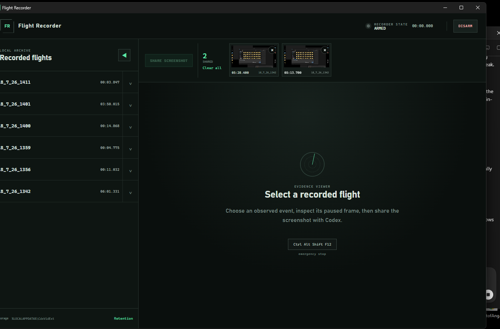

# Flight Recorder

Flight Recorder creates local, time-addressable video evidence for Codex computer-use sessions on Windows. It records the selected display, correlates real Windows input observations with Codex lifecycle events, and lets a user pause on an exact frame and share that snapshot back through MCP.



## What it provides

- A persistent Windows desktop recorder with Disarmed, Armed, Recording, Finalizing, and Error states.
- Windows Graphics Capture at 30 fps with Low, Medium, and High H.264 profiles.
- 1080p, 2K, and native-resolution recording modes.
- Configurable flight and snapshot storage, retention policies, and automatic cutoff.
- Durable GUI sessions for grouping, switching, renaming, and deleting related flights and snapshots.
- A local evidence reviewer with event navigation and exact-frame PNG extraction.
- A persistent Shared frames tray for handing selected screenshots back to Codex.
- Nine backward-compatible MCP tools under the existing `cdxvidext` namespace.
- Codex prompt/tool/stop lifecycle hooks that never block the main task on recorder failure.

Raw prompt text is not persisted. Prompt length and SHA-256 are retained for correlation. Recognized sensitive input text is AES-GCM encrypted and its key is protected with Windows DPAPI. MP4 screen recordings are local and unencrypted.

## Supported systems

- Windows 10 version 1903 or newer, x64
- Windows 11, x64
- Codex Desktop and Codex CLI
- Microsoft Edge WebView2 Runtime

Rust, Visual Studio, Python, and a system-wide FFmpeg installation are not required when using the installer. The release contains statically linked Rust executables and the pinned FFmpeg 8.1.2 Essentials runtime.

ARM64, macOS, Linux, audio, automatic updates, and Authenticode signing are not currently supported.


## Privacy and local security

First-run consent is required before any UI, bridge, hook, or MCP path can arm the recorder. The notice explains that:

- MP4 video is unencrypted.
- Input observation covers the interactive desktop while recording, not only the selected monitor.
- Evidence stays local unless the user explicitly shares or exports it.
- Retention controls and `Ctrl+Alt+Shift+F12` are available.

The reviewer binds to an ephemeral `127.0.0.1` port. All reviewer routes require a random per-launch HttpOnly session cookie, and state-changing requests require the expected origin. IPC rejects clients from another Windows logon session and limits message size. Programs running as the same Windows user remain inside the local trust boundary.

See [PRIVACY.md](PRIVACY.md), [SECURITY.md](SECURITY.md), and [TERMS.md](TERMS.md).

## Build from source

Building from source is intended for developers who want to modify Flight Recorder or produce their own Windows build. Install these prerequisites first:

- Rust stable with the MSVC target
- Visual Studio C++ Build Tools
- Microsoft Edge WebView2 development components
- PowerShell
- Python for Codex plugin validation
- FFmpeg and FFprobe available on `PATH`

From a PowerShell prompt at the repository root, build the release executables and assemble the Codex plugin:

```powershell
.\scripts\Build-Plugin.ps1
```

Static CRT linking is configured in `.cargo/config.toml`. The build script copies both release executables into `plugins\flight-recorder\bin` and runs the official Codex plugin validator.

To create a distributable bundle from your source build, run:

```powershell
.\scripts\New-ReleasePackage.ps1
```

The packaging script downloads and verifies the pinned FFmpeg archive, includes the required licensing materials, and writes the generated assets under `dist`. See the [Engineering Manual](docs/ENGINEERS_MANUAL.md) for the deeper architecture, development, validation, and troubleshooting reference.

## Repository layout

- `apps/desktop` — Tauri desktop companion and embedded reviewer
- `apps/bridge` — hooks, CLI, and MCP server
- `crates/core` — capture, storage, privacy, presentation, IPC, and manager logic
- `plugins/flight-recorder` — installable Codex plugin
- `.agents/plugins/marketplace.json` — repository marketplace
- `scripts` — build, packaging, installation, and diagnostic tools
- `docs/ENGINEERS_MANUAL.md` — complete architectural and operational reference

## Licensing

Flight Recorder source is MIT licensed. Release packages aggregate the separate GPLv3 FFmpeg 8.1.2 Essentials executables. Exact source, license, hash, and distributor information are in [THIRD_PARTY_NOTICES.md](THIRD_PARTY_NOTICES.md) and are included in every package.
