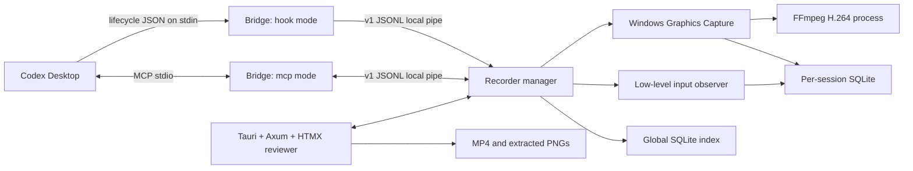
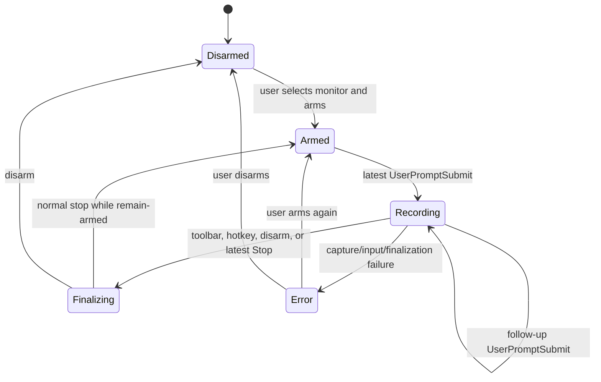

# Flight Recorder Engineer's Manual

This manual is the operational and architectural reference for engineers and coding agents working on Flight Recorder. It describes the Windows implementation as it exists today, including its build system, runtime processes, Codex integration, storage, privacy boundaries, extension points, verification strategy, troubleshooting procedures, and release gaps.

The intended reader is arriving without access to the design conversation that produced the project. After reading this manual, that reader should be able to:

- build and run the Windows recorder from source;
- connect its hooks and MCP server to Codex Desktop;
- explain a recording from prompt submission through finalization;
- inspect a failed recording without damaging its evidence;
- change capture, input, storage, reviewer, hook, or MCP behavior in the correct layer;
- verify changes using real Windows services and devices rather than mocks;
- prepare a development plugin package and identify what remains before public distribution.

## Quick navigation

1. [Current status and scope](#1-current-status-and-scope)
2. [Architectural overview](#2-architectural-overview)
3. [Lifecycle and state machine](#3-lifecycle-and-state-machine)
4. [Time model](#4-time-model)
5. [Windows development workstation](#5-windows-development-workstation)
6. [Build and run workflows](#6-build-and-run-workflows)
7. [Codex plugin integration](#7-codex-plugin-integration)
8. [Local bridge protocol](#8-local-bridge-protocol)
9. [Capture and encoding pipeline](#9-capture-and-encoding-pipeline)
10. [Input observation and semantic text](#10-input-observation-and-semantic-text)
11. [Raw events, correlation, and friendly presentation](#11-raw-events-correlation-and-friendly-presentation)
12. [Storage model](#12-storage-model)
13. [Encryption and privacy](#13-encryption-and-privacy)
14. [Reviewer architecture and extension points](#14-reviewer-architecture-and-extension-points)
15. [Testing strategy](#15-testing-strategy)
16. [Troubleshooting runbooks](#16-troubleshooting-runbooks)
17. [Diagnostics and evidence handling](#17-diagnostics-and-evidence-handling)
18. [Packaging and release engineering](#18-packaging-and-release-engineering)
19. [Change discipline and handoff](#19-change-discipline-and-handoff)
20. [Known limitations and technical debt](#20-known-limitations-and-technical-debt)
21. [Documentation maintenance](#21-documentation-maintenance)

## 1. Current status and scope

Flight Recorder `0.2.0-preview.1` is a portable, unsigned Windows x64 preview. Its source, marketplace, per-user installer, managed media runtime, privacy controls, and draft-release workflow are implemented. Public release remains gated on acceptance of the exact draft package in a clean standard-user Windows environment.

Current package identity:

| Item | Current value |
| --- | --- |
| Product name | Flight Recorder |
| Internal package prefix | `cdxvidext` |
| Rust workspace version | `0.2.0-preview.1` |
| Plugin version | `0.2.0-preview.1` |
| Public plugin ID | `flight-recorder` |
| Bridge protocol | Version 1 JSON Lines |
| Target | Windows x64 |
| License | MIT |

Implemented product behavior:

- One selected monitor is captured with Windows Graphics Capture.
- The cursor is included; audio is not recorded.
- Output preserves aspect ratio and uses the selected 1920×1080 ceiling, 2560×1440 ceiling, or encoder-safe even native dimensions.
- Frames are scheduled at a constant 30 frames per second and encoded as H.264 MP4 through FFmpeg.
- Windows mouse and keyboard activity is observed through low-level hooks on a dedicated thread.
- Prompt lifecycle and supported Computer Use tool intervals arrive through documented Codex hooks.
- Sessions, turns, frame indexes, raw events, tool calls, shared-frame records, and settings are stored in SQLite.
- Sensitive keyboard and recognized `type_text` content is encrypted with per-session AES-256-GCM keys protected by Windows DPAPI for the current user.
- The reviewer presents a smaller, friendly evidence model while MCP retains access to the detailed raw event timeline.
- During recording, the full reviewer becomes a stop-only toolbar at the bottom-right of the current monitor. It returns to its previous geometry after finalization.
- The Preferences modal owns future flight/snapshot roots, independent retention cohorts, automatic cutoff, capture quality/resolution, and live MCP presence.
- The reviewer owns durable archive sessions that group flights and screenshots, select the destination for new evidence, and cascade-delete a confirmed session locally.

Explicitly out of scope today:

- audio capture;
- multi-monitor compositing;
- replay or input injection;
- cloud upload or synchronization;
- semantic popup detection;
- whole-video encryption;
- Authenticode signing and automatic updates;
- macOS or Linux backends;
- direct insertion of shared images into the Codex composer.

### 1.1 Terminology

**Flight** and **recording session** refer to the same persisted recording. A flight can contain more than one Codex turn.

**Archive session** is the higher-level GUI container selected above Recorded flights. It groups flights, snapshot exports, and shared-frame tray records. Internally this remains distinct from the stable recording `session_id` used by MCP.

**Turn** is a prompt-to-stop unit identified by Codex. A follow-up prompt submitted while recording adds another turn to the active flight.

**Raw event** is an individual persisted observation, such as one coalesced pointer sample, a key packet, a semantic line, a requested action, or a recorder error.

**Presented event** is a GUI-friendly event derived from one or more raw events. Pointer samples are segmented, button pairs become clicks or drags, raw keys are hidden, and only user-navigable categories are counted.

**Shared screenshot** is a PNG extracted from a selected video time and added to the persistent handoff tray. It is made available to Codex through MCP; the desktop app does not inject it into the composer.

**Desktop recorder** is the persistent Tauri process that owns capture, input hooks, storage, the local reviewer, and the local IPC server.

**Bridge** is the lightweight executable used as a Codex hook handler, an MCP stdio server, a local control command, or a session verifier.

## 2. Architectural overview



The system intentionally has two executables instead of running capture inside every hook or MCP process:

- `cdxvidext-desktop.exe` persists for the user session. Only this process may own an active recorder, input hooks, capture session, WebView, and IPC listener.
- `cdxvidext-bridge.exe` starts quickly, performs one narrow job, and exits. In MCP mode it remains alive only for the stdio lifetime provided by Codex.

This separation is an invariant. Do not move capture or database ownership into hook processes. Codex can launch many hooks over a task, and MCP can restart independently; either would create duplicate recorders and competing input hooks.

### 2.1 Source workspace

The Rust workspace contains three packages:

| Package | Responsibility |
| --- | --- |
| `cdxvidext-core` | Models, state machine, WGC capture, input hooks, QPC clock, encryption, storage, action parsing, event presentation, IPC |
| `cdxvidext-desktop` | Tauri lifecycle, native window modes, global stop hotkey, Axum routes, server-rendered HTMX partials, reviewer assets |
| `cdxvidext-bridge` | Hook ingestion, MCP tools, recorder launch, local commands, verification reporting |

Supporting repository areas:

| Area | Responsibility |
| --- | --- |
| `apps/desktop/ui` | Static HTML, CSS, minimal JavaScript, vendored HTMX |
| `plugins/flight-recorder` | Plugin manifest, hooks, MCP configuration, skill, assets, packaged binaries |
| `scripts` | HTMX bootstrap, build/package automation, real hook test, real five-minute capture test |
| `evals` | Ten real-session evidence retrieval prompts |
| `artifacts` | Design and visual reference images; not runtime inputs |

### 2.2 Runtime threads and processes

The desktop recorder starts these long-lived activities:

| Activity | Purpose | Important constraint |
| --- | --- | --- |
| Tauri main thread | Native application and WebView | Owns native window runtime |
| `cdx-pipe-server` | Accept local bridge requests | One listener per Windows user namespace |
| One connection thread per pipe request | Parse and dispatch one JSONL request | Reject clients from another logon session |
| `cdx-review-server` | Axum on an ephemeral loopback port | Bound only to `127.0.0.1` |
| `cdx-window-mode` | Poll recorder state and reveal requests | Enters or leaves compact mode every 150 ms as needed |
| `cdx-input-hooks` | Install and pump low-level mouse/keyboard hooks | Callback work must remain timestamp-and-enqueue only |
| `cdx-input-writer` | Translate and persist input | Performs foreground lookup, correlation, encryption, and SQLite writes |
| WGC capture thread | Receive compositor frames | Copies pixels and uses a bounded handoff channel |
| `cdx-frame-encoder` | CFR scheduling, FFmpeg stdin, frame indexing | Owns the FFmpeg child and final media rename |

The input and frame worker threads exist only while a flight is recording.

## 3. Lifecycle and state machine

The recorder state is one of `Disarmed`, `Armed`, `Recording`, `Finalizing`, or `Error`.



### 3.1 Arming

Arming validates that the selected monitor still exists and stores its current WGC monitor index in memory. It does not create a session, start input hooks, create an MP4, or persist armed state.

Consequences:

- Restarting the desktop always returns to `Disarmed`.
- Monitor selection is not restored across desktop restarts.
- An armed recorder consumes little recording-specific work until a prompt arrives.
- Changing monitors while a flight is active is rejected.

### 3.2 Starting a flight

When a trusted and enabled `UserPromptSubmit` hook runs:

1. The bridge parses one JSON value from standard input without waiting for EOF.
2. It reads the Codex session and turn identifiers.
3. It computes prompt character count and SHA-256 in memory. The raw prompt is not sent to the desktop or persisted.
4. It records the hook time from QPC in 100 ns units.
5. It sends a protocol-versioned request to the desktop and waits up to 500 ms.
6. If the recorder is disarmed, the request succeeds with `recorder_not_armed`; Codex is not blocked.
7. If armed, the manager changes to `Recording`, creates the session storage, starts the input observer, and starts WGC capture.
8. The native window controller preserves the reviewer geometry, removes decorations, makes the window always-on-top, and docks the stop-only toolbar inside the monitor work area.

If capture cannot start, the manager records an error state and returns a warning through the hook. Prompt submission still continues.

### 3.3 Follow-up turns

A `UserPromptSubmit` received while a flight is active does not start a new MP4 or reset the time origin. It:

- flushes the pending semantic text line;
- inserts the new turn if it has not already been seen;
- updates the active `latest_turn_id`;
- returns the same flight ID with `continued: true`.

Turn insertion is idempotent. Duplicate turn identifiers do not produce duplicate rows.

### 3.4 Tool intervals and requested actions

The plugin hooks only `mcp__node_repl__js` for `PreToolUse` and `PostToolUse`.

At `PreToolUse`, the parser recognizes supported `sky` calls:

- `get_screenshot`
- `click`
- `drag`
- `move`
- `press_key`
- `scroll`
- `type_text`

The parser stores a best-effort requested-action record. Raw JavaScript is never persisted. For `type_text`, the public payload stores only length and a redacted flag; recognized text is encrypted.

At `PostToolUse`, the matching tool call is marked complete. Raw tool responses are not persisted by the manager.

Requested actions are annotations, not proof that an action occurred. Low-level Windows observations are authoritative. The friendly GUI does not give requested actions their own event, marker, count, or column.

### 3.5 Stopping and finalization

A flight can stop through:

- **Stop recording** in compact mode;
- `Ctrl+Alt+Shift+F12`;
- disarming;
- the manager-owned monotonic duration cutoff;
- the latest active turn's `Stop` hook.

The `Stop` hook ignores a stale or duplicate turn identifier. A current `Stop` ends the turn, waits 500 ms for a visible tail, then finalizes. The bridge allows up to 5.5 seconds for this request, while the hook configuration allows six seconds.

The optional cutoff is copied from Preferences when a new flight starts. A maintenance thread checks elapsed QPC time every 250 ms. On expiry it writes one `automatic_cutoff` recorder event, competes through the same single-owner finalization path as Stop, and returns to `Armed`. Editing Preferences never changes an active flight.

Finalization:

1. takes the active session out of runtime state and sets `Finalizing`;
2. stops input observation and flushes pending text;
3. stops WGC and closes the frame channel;
4. lets the encoder duplicate the last frame through the final time slot;
5. closes FFmpeg stdin and waits for FFmpeg;
6. renames `capture.mp4.part` to `capture.mp4` only after a successful encoder exit;
7. records final duration, frame count, raw event count, end time, and `ready` state;
8. attempts to generate a middle-frame poster;
9. returns to `Armed` after a normal stop, or `Disarmed` after disarm;
10. restores and focuses the full reviewer window.

If input, capture, or final storage fails, the session is marked `error`, which the GUI presents as **Interrupted**.

### 3.6 Crash recovery

At desktop startup, every index row still marked `recording` is changed to `error` with a recovery end time. The recorder does not attempt to repair or promote a remaining `.part` file automatically.

Recovery also applies the configured retention policy. This occurs before the manager becomes available on the local pipe.

## 4. Time model

All internal event and frame positions are signed 100 ns values relative to the active flight's QPC origin.

- `QueryPerformanceCounter` supplies monotonic ticks.
- `QueryPerformanceFrequency` supplies ticks per second.
- Conversion uses integer 128-bit intermediate arithmetic to avoid floating-point drift.
- The `UserPromptSubmit` hook timestamp becomes the session origin.
- Stored session offsets use `current_qpc_100ns - origin_qpc_100ns`.
- One millisecond equals 10,000 stored units.
- The 30 fps encoder period is 333,333 stored units, approximately 33.3333 ms.

UTC timestamps in the index describe wall-clock start and end time. They are not used for frame/event correlation. The GUI converts the start timestamp to local time for titles and friendly dates.

The generated title format is `day_month_two-digit-year_hourminute`, for example `18_7_26_1220`.

## 5. Windows development workstation

### 5.1 Required software

- Windows 10 version 1903 or newer, x64.
- Rust stable with the MSVC target and support for Rust 2024 edition.
- Visual Studio Build Tools with Desktop development with C++ and an appropriate Windows SDK.
- Microsoft Edge WebView2 Runtime.
- For source builds, FFmpeg and FFprobe available on `PATH`; release installs use the managed pinned runtime under `%LOCALAPPDATA%\CdxVidExt\runtime\ffmpeg\8.1.2`.
- PowerShell.
- Python when running the Codex plugin validator.
- Codex Desktop when testing plugin hooks, MCP startup, or end-to-end recording.
- Network access for first-time Cargo dependency retrieval and the HTMX vendor script.

The currently verified workstation uses Rust/Cargo 1.93.1 and FFmpeg/FFprobe 8.1. These are known-working versions, not intentionally enforced minimums.

### 5.2 Workstation checks

Run from PowerShell:

```powershell
rustc --version
cargo --version
ffmpeg -version
ffprobe -version
Get-Command ffmpeg, ffprobe
```

Confirm the MSVC host toolchain:

```powershell
rustup show active-toolchain
rustup target list --installed
```

The expected target includes `x86_64-pc-windows-msvc`.

### 5.3 Dependency notes

Important pinned components include Tauri 2, Axum 0.8, HTMX 2.0.8, SQLite through bundled `rusqlite`, the official Rust MCP SDK, `windows-capture`, and the Windows crate.

`rusqlite` uses its bundled SQLite feature, so a system SQLite library is not required. The `sqlite3` command-line program is optional and useful only for diagnostics.

HTMX is committed as a local runtime asset. The build script downloads the pinned 2.0.8 asset again and verifies that it looks valid before replacing the vendored copy.

## 6. Build and run workflows

All commands in this manual assume PowerShell at the repository root.

### 6.1 Fast development validation

```powershell
cargo check --workspace
cargo test --workspace
```

`cargo check` verifies compilation without producing runnable release binaries. `cargo test` currently executes 25 Windows tests across the core and desktop packages. Some of those tests use the real Windows QPC, real DPAPI for the current user, and real SQLite databases in temporary directories; they are not mock-service tests.

### 6.2 Run the reviewer in development mode

```powershell
$env:RUST_LOG = 'cdxvidext=debug'
cargo run -p cdxvidext-desktop
```

Development mode retains a console, making tracing output visible. Closing the native window hides it rather than terminating the process. Stop the development process from its launching terminal when a full restart is required.

Only run one desktop recorder at a time. A second instance will fail to bind the per-user pipe.

### 6.3 Build the packaged plugin binaries

```powershell
.\scripts\Build-Plugin.ps1
```

The script performs these operations in order:

1. downloads and validates HTMX 2.0.8;
2. runs `cargo test --workspace` unless `-SkipTests` was supplied;
3. builds the full workspace in release mode;
4. copies the desktop and bridge executables into the plugin's `bin` directory.

Use the skip switch only when tests have already passed against the same source and toolchain:

```powershell
.\scripts\Build-Plugin.ps1 -SkipTests
```

The script expects the plugin `bin` directory to exist. If a clean source distribution omits empty directories, create that directory before building or improve the script as a separate change.

Release outputs:

- `target\release\cdxvidext-desktop.exe`
- `target\release\cdxvidext-bridge.exe`
- packaged copies under `plugins\flight-recorder\bin`

### 6.4 Direct bridge commands

The bridge defaults to `open` mode when no argument is supplied.

```powershell
.\target\release\cdxvidext-bridge.exe open
.\target\release\cdxvidext-bridge.exe status
.\target\release\cdxvidext-bridge.exe preferences
.\target\release\cdxvidext-bridge.exe mcp-status
.\target\release\cdxvidext-bridge.exe arm 1
.\target\release\cdxvidext-bridge.exe stop
$sessionId = 'paste-session-id-here'
.\target\release\cdxvidext-bridge.exe verify $sessionId
.\target\release\cdxvidext-bridge.exe frame $sessionId 0
```

`open` starts the desktop if necessary, waits up to two seconds for the pipe, then asks the existing window to reveal itself. `arm` uses the monitor index returned by status; do not assume display ordering. `verify` reads persisted data directly and does not require the desktop process.

Do not manually run `hook` without supplying one valid Codex-shaped JSON value on standard input. Do not manually run `mcp` in an ordinary terminal unless using an MCP client; protocol messages and logs use stdio.

### 6.5 Clean rebuild without deleting evidence

Cargo build artifacts and recorded evidence are separate. Removing `target` does not remove flights. Recorded evidence lives in the current user's local application data.

When a clean Cargo build is genuinely needed, remove only the repository's `target` directory after resolving its absolute path and confirming it is inside the repository. Never remove `%LOCALAPPDATA%\CdxVidExt` as part of a build cleanup.

## 7. Codex plugin integration

The plugin root contains:

- the required manifest;
- an MCP configuration;
- default-discovered lifecycle hooks;
- the Flight Recorder usage skill;
- brand assets;
- both packaged Windows executables.

Codex installs plugins into its plugin cache and runs the installed copy. Editing the source tree does not automatically update the installed plugin copy.

### 7.1 Portable installed-root behavior

The MCP configuration sets `cwd` to the installed plugin root and launches `./bin/cdxvidext-bridge.exe`. Windows hook commands use the quoted `%PLUGIN_ROOT%\bin\cdxvidext-bridge.exe` path supplied by Codex. Neither configuration contains a username, checkout, personal-marketplace, or fixed cache path.

`Test-PortablePackage.ps1` performs a real Codex marketplace installation under a temporary `CODEX_HOME` whose path contains spaces, finds the installed cache copy, executes its bridge, and validates the installed hook definition. The clean-machine gate still validates these paths in Codex Desktop before publication.

### 7.2 Hook discovery, replacement, and trust

The packaged plugin owns its four hooks through `hooks/hooks.json`. The release installer copies a pristine plugin into a new staging directory, injects a new install identity and current version into those plugin-relative commands, removes the prior plugin and cache, and asks Codex to install that staged plugin. The Hooks UI must therefore show exactly one Flight Recorder source under **From Plugins > flight-recorder** and no Flight Recorder entry under **User config**.

Every install starts from the packaged plugin hook file and creates four fresh plugin-owned handlers with a new random install identity. Nothing from the previous installed plugin hook definition or cache is retained. Installer and uninstaller cleanup recognizes and removes user-config entries created by the defective interim preview, but never creates user-config hooks. Unrelated user hooks and metadata are preserved with a same-directory temporary file followed by atomic replacement.

The current hook set is:

| Event | Matcher | Purpose |
| --- | --- | --- |
| `UserPromptSubmit` | all | Start a flight or add a turn boundary |
| `PreToolUse` | exact `mcp__node_repl__js` | Start tool interval and parse supported requested actions |
| `PostToolUse` | exact `mcp__node_repl__js` | Complete tool interval |
| `Stop` | all | End the latest turn, capture a 500 ms tail, finalize |

Plugin installation or enablement does not automatically trust command hooks. Codex stores trust against the exact hook-definition hash. The generated install identity deliberately changes that hash on every install, so the user must review and trust the newly installed commands instead of inheriting a stale trust decision.

Operational checklist after a hook change:

1. rebuild and restage both executables and plugin files;
2. change the plugin version/cachebuster so Codex does not retain the old package;
3. run the installer or reinstall through the configured marketplace and regenerate the staged plugin hooks;
4. review and trust the new hook definitions in Codex;
5. restart Codex Desktop when MCP or plugin startup configuration changed;
6. begin a new Codex task for the cleanest verification;
7. arm the recorder before submitting the test prompt.

Hooks can also be globally disabled by Codex configuration or restricted by managed policy. An enabled plugin therefore does not prove its hooks can run.

Official references: [Codex hooks](https://learn.chatgpt.com/docs/hooks) and [building Codex plugins](https://learn.chatgpt.com/docs/build-plugins).

### 7.3 Hook input and output contract

The bridge accepts common snake-case and camel-case field variants for session, turn, tool, and tool-call identifiers. It reads exactly one JSON value and writes one JSON object plus a newline.

Prompt delivery is idempotent by turn identifier. A duplicate `UserPromptSubmit` received while capture is starting cannot claim a second startup, and a duplicate received after the flight becomes active does not add the same turn twice. This protects the recorder if a Codex release dispatches both the packaged fallback hook and the installer-generated user hook. The real duplicate-delivery test starts two bridge hook processes against the armed recorder concurrently and requires exactly one new, complete on-disk session.

On a normal acknowledgement it returns an empty object:

```json
{}
```

Recorder connection, start, or timeout problems are returned as a `systemMessage`. They are warnings and are designed not to block the user's prompt.

The bridge's own acknowledgement deadlines are shorter than the outer hook timeouts:

| Hook class | Bridge deadline | Configured outer timeout |
| --- | ---: | ---: |
| Prompt/tool | 500 ms | 2 seconds |
| Stop | 5.5 seconds | 6 seconds |

Malformed hook JSON or a QPC failure can still cause the bridge process itself to fail. Use the real hook test and inspect the exact installed binary path when diagnosing that class of error.

### 7.4 MCP activation

The plugin registers one stdio MCP server by launching the bridge with `mcp`. Codex owns that process lifetime. The bridge forwards tool calls over the local pipe to the persistent desktop recorder.

Each real MCP bridge instance sends a private heartbeat immediately and then every two seconds. The payload includes a UUID instance ID, process ID, package version, executable path, and UTC start time. The desktop records receipt with a monotonic clock, expires entries after five seconds, and shows the freshest instance plus the current instance count in Preferences. A graceful stdio shutdown also sends a disconnect request. `Connected` therefore means a live Codex-owned bridge is reaching this exact desktop process; it does not merely mean that an MCP configuration file exists.

MCP configuration changes generally require Codex Desktop to restart. Use a new task after restart to avoid relying on an already-initialized tool list.

The current server exposes nine tools:

| Tool | Result |
| --- | --- |
| `open_recorder` | Starts or reveals the companion and returns live state |
| `get_recording_status` | State, armed monitor, active session/turn, elapsed time, errors, monitor list |
| `list_recording_sessions` | Newest-first paginated session summaries |
| `get_session_timeline` | Time-filtered, paginated raw debug events |
| `get_frame_at` | Nearest indexed PNG plus structured evidence |
| `get_selected_frame` | Newest shared frame, or the saved reviewer selection when the tray is empty |
| `list_shared_frames` | Persistent handoff tray metadata, oldest to newest |
| `get_shared_frame` | One shared PNG by stable share ID |
| `get_shared_frames` | Every currently shared PNG plus complete structured metadata |

Image tools return both MCP image content and structured content. The bridge reads the image file only after the desktop has resolved the requested frame.

MCP does not arm a monitor, delete flights, change retention, or inject screenshots into the composer. Those are intentionally desktop-owned user actions.

### 7.5 Plugin versioning and cachebusters

There are three related version surfaces:

- the Rust workspace version, used by the bridge MCP implementation metadata;
- the Tauri product version;
- the plugin manifest version, currently including a Codex cachebuster suffix.

For a release, update them intentionally and record why they differ. During local plugin iteration, the manifest cachebuster must change whenever Codex needs to treat the plugin contents as a new install. A source build with unchanged plugin version can leave Codex running a cached older bundle.

## 8. Local bridge protocol

The desktop and bridge communicate using one request and one response, each encoded as a single JSON line. Every response includes `protocol_version`, `ok`, `data`, and `error`.

The namespace name is derived from a SHA-256 hash of the Windows username and includes protocol version 1. The server additionally obtains the peer process ID and rejects clients from a different Windows logon session.

The request model supports:

- open, status, arm, disarm, and stop;
- session listing and raw timeline pagination;
- frame extraction and sharing;
- shared-frame listing, removal, and clearing;
- session deletion, confirmed pinned deletion, renaming, and pinning;
- loading/saving typed Preferences and querying MCP presence;
- MCP heartbeat and disconnect updates;
- legacy retention changes for protocol-v1 compatibility;
- hook lifecycle delivery.

### 8.1 Protocol invariants

- Additive changes should remain compatible within protocol version 1.
- Breaking enum tags, field meanings, or framing require a protocol version change and a new namespace.
- Keep each connection short-lived and one-request/one-response.
- Never send raw prompt text through this protocol.
- Never perform IPC from a low-level Windows hook callback.
- Treat the desktop manager as the authority for state transitions.

### 8.2 Security boundary

The pipe check isolates Windows logon sessions, not individual processes within the same session. Any process running in the same interactive logon session may potentially reach the recorder if it knows the namespace and protocol. Do not treat the pipe as an authorization boundary between mutually untrusted processes owned by the same logged-in user.

## 9. Capture and encoding pipeline

### 9.1 Monitor enumeration

WGC monitor enumeration supplies the display index, friendly name or device string, device name, source dimensions, and primary flag. The reviewer asks the user to select one enumerated monitor before arming.

Monitor indexes are runtime values. Do not persist or hardcode an index across display topology changes.

### 9.2 Output dimensions

The selected resolution mode is copied when a flight starts:

- **1080p** scales uniformly to fit within 1920×1080. A 1920×1200 source becomes 1728×1080.
- **2K** scales uniformly to fit within 2560×1440.
- **Native** keeps the source size except for rounding each dimension down to an even value.

Ceiling modes never upscale a smaller source. All modes produce at least 2×2 output.

Even dimensions are required by common YUV 4:2:0 H.264 encoders.

### 9.3 WGC settings

The capture session uses:

- the selected monitor;
- cursor capture enabled;
- the WGC border disabled;
- secondary windows excluded according to the capture library setting;
- a custom minimum update interval of approximately 33.333 ms;
- BGRA8 frames;
- no audio path.

Frame arrival obtains the compositor-relative timestamp, copies the no-padding BGRA buffer, and attempts to place it on a bounded channel of three frames. If the channel is full, the frame is discarded and a drop counter is carried into the next accepted frame.

### 9.4 Constant-rate scheduling

The encoder worker uses 30 fps slots beginning at offset zero.

- A source frame arriving before the next slot is counted as a scheduler drop.
- Gaps between source frames are filled by duplicating the last accepted pixels.
- Each encoded slot receives a `frames` row.
- The row records source timestamp, whether it was duplicated, source/scheduler drops before it, and a lightweight visual-change score.
- At finalization, the last pixels are duplicated through the final elapsed slot.

The WGC callback never waits on FFmpeg or SQLite. Pixel copying and bounded enqueueing are the only significant callback work.

### 9.5 FFmpeg selection and output

At flight start, the worker probes encoders in this order:

1. `h264_nvenc`
2. `h264_amf`
3. `libx264`

Each candidate must encode a generated frame at the flight's complete requested output dimensions using its complete selected quality profile. A hardware encoder that exists but rejects the resolution, rate control, quantizer, or preset is skipped before WGC begins feeding it.

| Quality | Quantizer | NVENC | AMF | x264 |
| --- | ---: | --- | --- | --- |
| Low | 30 | `p3` | `speed` | `veryfast` |
| Medium | 23 | `p4` | `balanced` | `fast` |
| High | 18 | `p6` | `quality` | `medium` |

The per-flight database retains the requested quality, requested resolution mode, and actual selected encoder. Preferences default to Medium and 1080p.

FFmpeg receives raw BGRA video on stdin, applies Lanczos scaling and a 30 fps filter, disables audio, emits YUV 4:2:0 H.264 with a 30-frame GOP, and enables MP4 fast-start metadata.

Encoding first targets `capture.mp4.part`. A successful FFmpeg exit causes the worker to rename it to `capture.mp4`. If the final MP4 is missing but a `.part` file remains, investigate encoder exit and process interruption; do not simply rename it without validating it with FFprobe.

### 9.6 Capture failure behavior

There are two failure timing classes:

- Synchronous WGC start failure is returned to the manager and changes recorder state to `Error`.
- Encoder launch failure occurs inside the frame worker. It records an `encoder_error` raw event, but WGC may already have reported a successful start. The finalization path is therefore the authoritative place to confirm that a usable MP4 exists.

This distinction matters when diagnosing a flight that appears in the index but has no playable media.

## 10. Input observation and semantic text

### 10.1 Low-level hook contract

The recorder installs `WH_MOUSE_LL` and `WH_KEYBOARD_LL` on one lightweight message-pump thread.

Callbacks:

- obtain QPC time;
- copy the native packet fields;
- perform a non-blocking enqueue into a channel of 4,096 entries;
- immediately call the next hook.

Callbacks do not access SQLite, DPAPI, foreground-window metadata, the local pipe, FFmpeg, or the reviewer.

If the channel is full, the current callback packet is dropped rather than blocking Windows input. The current implementation does not persist a separate input-channel-drop counter.

### 10.2 Mouse processing

The worker coalesces pointer moves to at most 60 Hz. Persisted raw mouse details include:

- screen coordinates;
- native message number;
- button or wheel data;
- current left/right/middle button bit state;
- native flags and injected-event flag;
- foreground window title and process ID;
- nearest requested tool-use ID and time-derived confidence when available.

Button state is updated before the event is persisted. Pointer movement while a button is held later becomes part of a friendly drag.

### 10.3 Keyboard processing

Raw key events store only injected status publicly. Virtual key, scan code, native message, flags, and injected status are serialized and encrypted.

On key-down, the worker uses the foreground thread's active keyboard layout and `ToUnicodeEx` to translate printable input. It maintains a semantic line buffer:

- printable characters append to the line;
- Backspace edits the pending line;
- Enter, Tab, Escape, navigation keys, Insert/Delete, and F1 through F24 flush the line and become individual commands;
- Ctrl, Alt, or Windows shortcuts flush the line and become commands such as `Ctrl+V`;
- pointer button/wheel actions, turn boundaries, and orderly worker shutdown flush pending text;
- modifier key packets by themselves do not become friendly events.

A completed line is stored as one encrypted `text_line` event with public length and start/end offsets. Navigation seeks to the final character time, which is most likely to show the complete text onscreen.

Manual clipboard content is not captured for `Ctrl+V`; only the shortcut is recorded. A correlated Codex `type_text` request may provide separately encrypted supporting text when the parser recognized it.

### 10.4 Global scope warning

Low-level hooks observe input across the interactive Windows desktop while a flight is active, not only the selected monitor or foreground application. This is a central privacy property and must remain visible in user-facing release documentation.

## 11. Raw events, correlation, and friendly presentation

### 11.1 Raw debug timeline

The per-session `events` table is append-oriented and preserves technical observations. Sources currently include:

- `os_input`
- `semantic_input`
- `requested_action`
- `recorder`

Raw events may carry a confidence and tool-use ID. Input correlation searches for the nearest requested action within 500 ms. Confidence decreases linearly from 1.0 at the same timestamp to 0.0 at the edge of that interval.

The MCP timeline exposes public payloads and whether an encrypted payload exists. It never decrypts sensitive payloads by default.

### 11.2 Friendly event registry

The reviewer derives categories dynamically. Empty categories are omitted.

| Category | Color | Derivation |
| --- | --- | --- |
| Pointer movement | Cyan | Consecutive pointer samples between observed actions |
| Click | Coral | Button down/up pair with no movement |
| Drag | Orange | Button down, movement while held, and button up |
| Scroll | Violet | Wheel observation with decoded direction |
| Text input | Yellow | Semantic line or key command |
| Recorder | Gray, or red for errors | Recorder-originated events |

Requested actions, raw key packets, and incomplete technical observations do not become independent friendly events.

Each category receives its own sequence numbers. The collapsed row contains only sequence and time. Details are loaded lazily, and sensitive text is decrypted only when that detail is expanded.

### 11.3 Pointer segmentation

All raw coalesced samples are retained. The presentation layer groups consecutive movement into one event with only beginning and ending coordinates.

A pointer segment ends when another observed action is encountered or the event stream ends. Movement while a button press is active is absorbed into a drag and does not also create a pointer-movement event.

The marker spans the segment's start and end. Clicking the event navigates to its ending frame.

### 11.4 Frame snapping

Presentation first uses exact event offsets, then resolves a `seek_offset_ms` against the nearest indexed real 30 fps frame. The timeline marker remains located at the event's actual time; event navigation uses the snapped time.

The browser pauses before setting `currentTime`, waits for `seeked`, and pauses again. Selection is indicated by both color and a non-color active state.

### 11.5 Visible counts

The flight list's event total, telemetry column entries, and timeline markers all derive from the same presented timeline. Raw event count in the global index is intentionally not shown in the GUI and may be much larger.

## 12. Storage model

The fixed control-data root is `%LOCALAPPDATA%\CdxVidExt`. Preferences can direct new flight folders and new snapshot PNGs to distinct absolute writable roots. Path changes affect future evidence only; global index rows retain exact paths for existing evidence.

```text
CdxVidExt
├── index.sqlite3
├── index.sqlite3-wal / index.sqlite3-shm when active
├── exports
│   └── <archive-session-id>
│       └── <stable-recording-session-id>
│           └── frame-<requested-offset-ms>.png
└── sessions
    └── <archive-session-id>
        └── <stable-recording-session-id>
            ├── session.sqlite3
            ├── session.sqlite3-wal / session.sqlite3-shm when active
            ├── session.key
            ├── capture.mp4 or capture.mp4.part
            ├── thumbnails
            │   └── poster.jpg
```

`exports` and `sessions` above are defaults. Selected roots may be elsewhere. Legacy flights can still contain an `exports` subdirectory; registered legacy snapshots are relocated to the current snapshot root before their containing flight is deleted.

Archive-session names are metadata only. Renaming never moves evidence because new paths use the stable archive ID. Migration creates and selects `Default Session`, assigns existing flights and registered screenshots to it, and preserves all existing paths. New snapshots use `<snapshot-root>\<archive-session-id>\<recording-session-id>`.

### 12.1 Global index

The global database uses WAL mode and contains:

**archive_sessions** — stable archive ID, unique normalized display name, and creation time. The active archive ID is stored in settings.

**sessions** — stable recording ID, archive membership, UTC start/end, raw state, duration, monitor name, output size, raw frame/event counts, pin state, media path, exact storage root/session path, and optional display name.

**settings** — atomically replaced `preferences_v1`, legacy retention compatibility, and persistent selected-frame settings.

**snapshot_exports** — stable snapshot ID, archive membership, source flight/time, snapped frame/time, exact PNG path/root, MIME type, creation time, and cached nearest-event metadata.

**shared_frames** — stable share ID and archive membership linked to the snapshot registry plus enough duplicated timing/event metadata for the tray entry to remain readable after source-flight deletion.

Index migrations are idempotent. Older session rows derive their exact paths from the preserved media path. Existing Shared-frame rows are enrolled in the snapshot registry without rewriting the PNG. No semantic telemetry is reconstructed for legacy sessions.

### 12.2 Per-session database

Each flight database uses WAL mode and contains:

**session** — schema version, QPC origin/frequency, monitor, source/output dimensions, actual encoder, requested quality, and requested resolution mode.

**turns** — turn ID, start/end offsets, prompt character count, and prompt SHA-256.

**frames** — frame number, schedule offset, source compositor time, duplication flag, drop count, and visual-change score.

**events** — raw event time, source, kind, summary, confidence, tool correlation, JSON public payload, and optional encrypted payload.

**tool_calls** — tool-use ID, name, start/end offsets, and state.

**markers** and per-session **settings** — reserved persistence surfaces; the current friendly marker board is derived from events rather than stored in these tables.

### 12.3 WAL inspection safety

Do not copy or inspect only the main SQLite file while the recorder is active. Recent rows may still reside in the `-wal` file. For reliable diagnostics:

1. stop/finalize the flight;
2. exit the desktop process if a consistent cold copy is required;
3. copy the database together with its WAL/SHM companions, or use SQLite's backup facility;
4. perform analysis on the copy.

Never edit a production session database to make a test pass. Derived indexes can be regenerated only by intentional migration code; source evidence should remain immutable during diagnosis.

### 12.4 Rename, pin, deletion, and retention

Archive-session names are trimmed, contain 1–80 Unicode characters, and are unique ignoring case. Create selects the new archive; selection persists across restarts. Session controls are rejected while recording or finalizing so a flight cannot change ownership during creation.

Confirmed archive-session deletion rechecks its displayed flight, pinned-flight, snapshot, and shared-frame counts before removing evidence. Every existing registered path is resolved and checked beneath its persisted storage root before any recursive deletion. Pinned flights are included. The newest surviving archive is selected afterward; deleting the last archive creates a fresh empty `Default Session`.

Custom flight titles are trimmed and must contain 1–80 Unicode characters. Duplicates are allowed. Resetting sets the custom title to null and restores the generated timestamp title.

Pinned flights cannot be deleted by the ordinary delete operation. The GUI's strong confirmation sends an explicit pinned-delete flag. Deletion validates the persisted path against that flight's persisted storage root. Registered snapshots outside the flight survive; registered legacy snapshots still inside the flight are relocated before its directory is removed. Shared rows retain cached metadata and remain readable.

Flight and snapshot retention default Off and operate independently. Each enabled policy stores an activation UTC boundary. Only evidence created at or after that boundary can expire, permanently grandfathering evidence already present when Off changes to On. Changing days while On preserves the boundary; disabling clears it; re-enabling creates a new boundary. A migrated legacy `retention_days` value becomes an enabled flight policy whose activation is upgrade time.

Flight purge skips pinned, recording, and finalizing rows. Snapshot purge deletes the real PNG, all linked tray rows, and the registry row together. Purge runs at startup, immediately after a Preferences save, and hourly. Retained snapshots are independent of source-flight retention.

## 13. Encryption and privacy

### 13.1 Key hierarchy

Every flight creates a random 256-bit AES key. Windows DPAPI protects that key for the current user and writes the protected blob as `session.key`.

Each sensitive event:

- receives a fresh random 96-bit GCM nonce;
- is encrypted with AES-256-GCM;
- stores `nonce || authenticated ciphertext` in the SQLite BLOB.

Opening sensitive details loads and unprotects the key through DPAPI, authenticates the ciphertext, and returns the clear value to the local reviewer response.

Moving a session directory to another Windows account does not make its text decryptable. Losing the DPAPI profile or protected key makes encrypted event content unrecoverable.

### 13.2 What is and is not protected

Encrypted:

- raw keyboard packet details;
- semantic typed lines;
- recognized requested `type_text` content.

Not encrypted:

- MP4 video;
- extracted PNG screenshots and poster image;
- mouse coordinates and button/wheel details;
- foreground window titles and process IDs;
- event times, kinds, summaries, correlation IDs, and confidence;
- monitor and session metadata;
- prompt length and SHA-256.

The raw prompt itself is present transiently in the hook process because Codex supplies it, but only its character count and SHA-256 leave that process.

### 13.3 Loopback reviewer boundary

The reviewer server binds an ephemeral port on `127.0.0.1` and generates a random 256-bit token for every desktop launch. Tauri initially navigates to a one-time bootstrap URL; a valid token establishes an HttpOnly, SameSite=Strict cookie and redirects to the clean reviewer URL. Every static, media, decrypted-detail, preference, and mutation route requires that cookie. Non-GET requests must also carry the exact loopback origin. Responses disable caching and framing and suppress referrers.

The token is held only in process memory and is never logged or persisted. This blocks ambient web pages and unauthenticated loopback clients that merely discover the port. Processes running as the same interactive Windows user remain inside the local trust boundary.

## 14. Reviewer architecture and extension points

### 14.1 Rendering model

The native WebView loads an Axum server on a randomly assigned loopback port. Static HTML, CSS, JavaScript, and HTMX are embedded into the executable at compile time.

Most interface fragments are rendered on the server:

- live status and controls;
- archive-session selector and action state;
- recorded-flight list;
- selected-flight player;
- telemetry columns;
- lazy event details;
- shared-screenshot tray.
- centered Preferences modal and the polled MCP-presence panel.

Minimal browser JavaScript owns state that is inherently client-side:

- archive collapsed preference in `localStorage`;
- archive create/rename editor, switching refresh, and counted delete confirmation;
- currently expanded flight and event rows;
- selected flight highlight;
- video play/pause, frame stepping, and scrubber;
- SVG event markers;
- exact seek-and-pause behavior;
- rename/delete confirmations and toast messages;
- shared-frame preview and tray refresh.
- native folder selection requests, preference-control enablement, atomic Save, inline errors, and modal focus restoration.

### 14.2 Reviewer endpoints

JSON and media endpoints cover status, archive-session create/select/rename/delete preview/delete, recording sessions, raw timeline, decryption, video, shared images, arm/disarm/stop, selection, pin/delete/rename, timeline mapping, loading/saving Preferences, native folder selection, and MCP presence.

HTML partial endpoints cover status, session cards, the selected-flight reviewer, telemetry, lazy event details, the shared tray, the Preferences form, and its two-second MCP status refresh.

Preferences uses a native Windows folder picker through Tauri's desktop process. Save validates both locations by creating them and performing a real write/delete probe, rejects equal or nested roots, and writes one `preferences_v1` JSON value only after all validation succeeds. The HTML `dialog` provides modal Escape/Cancel behavior; opening focuses the first control, and server errors are displayed in a focused `role=alert` region.

When adding a feature, choose one presentation owner:

- core model or persistence for durable behavior;
- presentation registry for friendly evidence semantics;
- Axum handler/partial for server-rendered state;
- JavaScript only for browser state, media synchronization, or interaction that cannot be expressed cleanly through HTMX;
- Tauri only for native window/process/OS integration.

Do not duplicate event normalization in JavaScript. The presented timeline is the single source of truth for GUI counts and marker data.

### 14.3 Native window modes

Normal reviewer defaults:

- 1380 by 880 logical pixels;
- minimum 1080 by 700;
- decorated and resizable;
- not always-on-top.

Recording toolbar target:

- 620 by 73 client pixels;
- borderless and non-resizable;
- always-on-top;
- 12 physical pixels from the bottom-right of the monitor work area.

The controller stores normal position, inner size, and maximized state before entering compact mode. It rejects a compact-sized geometry as a valid normal restore size and falls back to the normal default when necessary.

Closing the native window is intercepted and hides the persistent companion. The bridge's `open` mode increments an in-process reveal epoch observed by the native window controller, allowing MCP or a local command to restore it.

### 14.4 Common extension recipes

**Add a new raw event:** extend the producer and persistence payload, preserve callback constraints, add real serialization tests, and decide explicitly whether it remains debug-only.

**Add a friendly category:** update the presentation registry, stable category order, accessible label, color token, grouping tests, server partial styling, and SVG marker tests. One presented event must still equal one visible count and one marker.

**Change text boundaries:** update only the worker-side assembler and its real unit tests. Never translate or assemble text in the low-level callback.

**Add an MCP tool:** add a protocol request if desktop data is required, dispatch it through the manager, implement the bridge tool schema and result type, update the plugin skill, README, this manual, and real MCP acceptance prompts.

**Add a reviewer action:** enforce the operation in core/store code, expose a narrow Axum route, and keep confirmations/presentation in the UI. Never rely on a browser confirmation as the only backend safety check.

**Change recording state behavior:** update the manager first, then the native window controller and status partial. Test duplicate hooks, stale stops, manual stop, hotkey stop, failure, and restart recovery.

**Change storage schema:** support existing databases with an explicit idempotent migration. Never assume a clean data root. Preserve stable session IDs and media paths.

## 15. Testing strategy

The project rule is to use real platform operations, real parsers, and real SQLite files. Do not introduce mock recorder services or fake Computer Use events as substitutes for acceptance evidence.

### 15.1 Automated suite

Run:

```powershell
cargo test --workspace
```

The current automated suite covers:

- all 1080p/2K/Native output calculations and exact Low/Medium/High profile arguments;
- a complete real FFmpeg profile probe on every encoder available to the workstation;
- integer QPC conversion and real monotonic QPC calls;
- real current-user DPAPI plus AES-GCM round trip;
- keyboard line assembly, Backspace, commands, shortcuts, and function keys;
- requested-action parsing and text redaction from real call shapes;
- pointer segmentation;
- click/drag pairing without duplicate pointer events;
- hiding requested actions and raw key packets from friendly telemetry;
- real SQLite preference round trips, legacy migrations, path safety, retention cohorts, pinned deletion, snapshot relocation/survival, encryption, idempotent turns/tool calls, cursors, renaming, and nearest-frame snapping;
- observable native-window reveal requests;
- friendly states, title formatting, compact positioning, geometry restoration, and visible branding.

Passing these tests does not prove that WGC can capture the current display, FFmpeg can encode on the current GPU, Codex hooks are trusted, MCP is loaded, or the native compact toolbar behaves correctly on the user's display topology.

### 15.2 Real Preferences and cutoff test

```powershell
.\scripts\Test-Preferences.ps1
```

This script backs up the user's real Preferences, saves unique real temporary flight/snapshot roots, and asks the user to arm an actual monitor. It starts WGC through the real hook/manager path, waits for a short manager-owned QPC cutoff, requires the recorder to return to Armed, verifies exactly one cutoff event and complete media, compares indexed dimensions with FFprobe, extracts a real PNG, verifies its selected root, and restores the original Preferences in `finally`. Use `-KeepEvidence` to preserve its temporary output.

### 15.3 Real hook bridge test

Prerequisites:

- release binaries built;
- desktop recorder running;
- recorder armed;
- local pipe available.

Run:

```powershell
.\scripts\Test-HookBridge.ps1
```

The script sends one real `UserPromptSubmit`-shaped value through the release bridge and requires valid JSON from the running recorder. It does not simulate a recorder service. Because it uses a generated session/turn identifier, it starts a real recording if the recorder is armed; stop and inspect that flight afterward.

### 15.4 Real five-minute capture

```powershell
.\scripts\Test-FiveMinuteCapture.ps1
```

The default duration is 300 seconds. The script:

- starts the release desktop executable;
- waits for the user to choose and arm a real monitor;
- sends a real hook request and measures acknowledgement;
- records actual WGC frames and low-level input for the requested duration;
- sends a real Stop hook;
- finds the newest persisted flight;
- runs the bridge verification report;
- asks FFprobe for actual media duration.

Use a shorter duration only for iterative diagnosis, not final acceptance:

```powershell
.\scripts\Test-FiveMinuteCapture.ps1 -Seconds 30
```

### 15.5 Verification report

```powershell
$sessionId = 'paste-session-id-here'
.\target\release\cdxvidext-bridge.exe verify $sessionId
```

The report includes:

- persisted duration and indexed duration;
- frame count and expected 30 fps slots;
- duplicated frames;
- dropped source frames;
- missing encoder slots and percentage;
- duration delta measured in frames;
- media path and output dimensions;
- requested quality/resolution, actual encoder, and automatic-cutoff event count.

Acceptance targets from the feasibility specification:

- first frame within 250 ms of the acknowledged prompt hook;
- MP4 and indexed duration within one frame;
- fewer than one percent missing encoder slots;
- input callbacks under 5 ms and no disk/IPC callback work;
- action, injected input, and visible frame correlation within 50 ms of the nearest captured frame for the approved Computer Use scenario.

The current report does not calculate first-frame latency or callback duration. Those require targeted inspection/instrumentation and a real acceptance run.

### 15.6 Computer Use and MCP acceptance

After installing and trusting the plugin, start a new Codex task and run an approved Windows application scenario containing screenshots, clicks, typing, scrolling, dragging, and a transient menu.

Verify:

- the prompt starts the already-armed recorder;
- the toolbar appears without stealing focus;
- requested actions appear only as raw MCP annotations;
- real observed events form the friendly columns and timeline markers;
- event clicks seek to a paused nearest frame;
- typed lines decrypt only when expanded;
- shared screenshots appear in the tray and are retrievable through MCP;
- automatic Stop returns the reviewer and leaves the recorder armed.

Exercise every MCP tool with MCP Inspector or Codex. Then run the ten real-session evaluation prompts and require at least eight intended evidence-retrieval workflows to complete.

Open Preferences during MCP acceptance. Confirm Connected appears within one heartbeat interval, includes the actual installed executable/PID/version, changes to Disconnected within five seconds after the bridge stops, and reconnects only after Codex restarts or starts a replacement MCP instance.

### 15.7 Privacy acceptance

Record a unique known phrase in a new real flight. After finalization:

1. confirm the phrase is visible only when intentionally captured onscreen or decrypted in the reviewer;
2. search SQLite databases and sidecar metadata as binary-safe content;
3. confirm the phrase is absent as plaintext from those stores;
4. expand the appropriate text event as the same Windows user and confirm correct decryption;
5. repeat under a different Windows account only if testing the expected DPAPI denial.

Remember that an unencrypted MP4 can visibly contain the phrase. A byte search is not an OCR privacy test and whole-media encryption is not implemented.

## 16. Troubleshooting runbooks

Start by identifying the failed layer. Do not reinstall everything before knowing whether the problem is desktop startup, pipe connectivity, recorder state, hook discovery/trust, capture, finalization, reviewer state, or MCP activation.

### 16.1 Baseline diagnostic sequence

```powershell
Get-Process cdxvidext-desktop, cdxvidext-bridge -ErrorAction SilentlyContinue
.\target\release\cdxvidext-bridge.exe status
Get-Command ffmpeg, ffprobe
cargo test --workspace
```

Interpretation:

- No desktop process and failed status: start with `bridge open`.
- Desktop process but failed status: suspect pipe bind/listener failure or a different binary/user context.
- Status works but state is `Disarmed`: hooks can run successfully without recording; arm in the GUI.
- Status is `Error`: inspect `last_error`, the newest session state, and recorder-originated events.
- Unit tests fail: fix the local source/toolchain before testing the installed plugin.

### 16.2 Desktop process is running but GUI is invisible

Run:

```powershell
.\target\release\cdxvidext-bridge.exe open
```

This is preferable to starting a second desktop. It sends `OpenRecorder`, which asks the existing native window controller to reveal the window.

If it remains invisible:

1. check whether status reports `Recording`; compact mode should be on the bottom-right of the window's current monitor;
2. inspect all connected monitors and work areas, including disconnected or recently rearranged displays; `-32000,-32000` is the Windows minimized sentinel and must never be retained as normal geometry;
3. run the debug desktop from a terminal with `RUST_LOG=cdxvidext=debug`;
4. look for `could not enter compact recording mode`, `could not restore the reviewer window`, or `could not reveal the recorder window`;
5. stop the existing process normally and restart one instance.

Alt-Tab is not authoritative because close hides the window and compact mode changes decorations. The native controller validates both saved and current positions against active monitor work areas. `OpenRecorder` forces a full restore and centers the reviewer whenever fewer than 64 pixels on either axis intersect an active work area.

### 16.3 Prompt submitted but recording does not start

Check in this order:

1. `bridge status` reports `armed: true` before prompt submission.
2. The selected monitor still exists.
3. The plugin is enabled in Codex.
4. Hooks are globally enabled and not suppressed by managed policy.
5. The plugin's hooks are reviewed, trusted, and enabled.
6. The installed hook command points to an existing bridge executable.
7. The installed bridge and desktop are from the same build.
8. A direct real hook bridge test succeeds.
9. The next prompt is submitted from a new task after any plugin/hook reinstall.

A message such as `recorder_not_armed` is a successful hook connection but an intentionally ignored recording request. A hook warning mentioning that Flight Recorder is not running indicates a binary path, desktop launch, or pipe problem.

### 16.4 Hook changed and is silently skipped

Codex trust is hash-based. Re-review the hook after any definition change. Verify that the plugin install actually contains the new hook file; editing the repository source is insufficient.

If the user trusted an older definition, Codex can correctly skip the changed one until it is trusted again.

### 16.5 MCP tools are missing

1. Verify the plugin is installed and enabled.
2. Verify the installed MCP command exists and runs the bridge with `mcp`.
3. Rebuild and restage the bridge.
4. Update the plugin cachebuster and reinstall the plugin.
5. Restart Codex Desktop.
6. Start a new task and inspect the available tools.

The MCP process is initialized by Codex, not by the already-running desktop. Leaving the desktop open is fine, but restarting only the desktop does not reload Codex's MCP configuration.

If the tools exist but Preferences shows Disconnected, query `cdxvidext-bridge.exe mcp-status`, confirm the executable path in the installed `.mcp.json`, and wait at least one two-second heartbeat interval. A status older than five seconds is intentionally removed. Multiple active Codex tasks may produce an instance count greater than one.

### 16.6 MCP reports Flight Recorder is not running

Call `open_recorder` or run bridge `open`. The bridge expects the desktop executable beside it and will attempt to launch that sibling file.

If it says the desktop is missing, the plugin package contains an incomplete `bin` directory or the MCP command points at a standalone bridge copy.

If the desktop starts but never becomes ready within two seconds, run the desktop in development mode to expose startup errors involving the data root, SQLite, pipe bind, Axum bind, WebView2, or Tauri.

### 16.7 Second desktop instance fails

The per-user pipe is single-owner. Find the existing process and reveal it with the bridge. Do not work around this by changing the pipe name unless intentionally changing the protocol/instance model.

### 16.8 Capture starts but video is missing or unplayable

Inspect the session directory:

```powershell
$sessionId = 'paste-session-id-here'
$sessionDir = Join-Path $env:LOCALAPPDATA "CdxVidExt\sessions\$sessionId"
Get-ChildItem -LiteralPath $sessionDir -Force
ffprobe -v error -show_format -show_streams (Join-Path $sessionDir 'capture.mp4')
```

Cases:

- Only `.part` exists: FFmpeg did not exit successfully or the process ended before rename.
- Neither media file exists: encoder launch likely failed before useful output.
- MP4 exists but has zero/short duration: inspect frame counts and missing slots with bridge `verify`.
- Recorder has `encoder_error`: confirm FFmpeg is on the environment inherited by the desktop and that at least `libx264` works.

Test encoders directly with a real FFmpeg invocation before changing capture code.

### 16.9 Hardware encoder fails

The recorder probes NVENC, then AMF, then libx264. A GPU-specific failure should fall back automatically. If all probes fail:

- verify the installed FFmpeg build includes `libx264`;
- check whether antivirus or application control blocks child processes;
- check the environment inherited by a GUI-launched desktop, not only the interactive terminal;
- run the encoder probe manually;
- confirm FFmpeg can create a file in the current user's local app data.

Do not hardcode a hardware encoder as a repair; preserve software fallback.

### 16.10 Input events are absent

1. Confirm a flight was actively `Recording`, not merely armed.
2. Inspect raw MCP timeline for `os_input` and `semantic_input` sources.
3. Run the debug desktop and look for low-level hook installation errors.
4. Check whether another recorder instance already owned the process-global callback sender.
5. Check Windows security software and integrity/elevation boundaries.
6. Confirm the test actually generated global mouse/keyboard activity after the hook start acknowledgement.

Do not add SQLite writes or logs to the callbacks while diagnosing. Instrument callback duration with lock-free counters or external timing and drain it on the worker.

### 16.11 Too many pointer events in the GUI

First distinguish raw timeline from presented telemetry.

- Many `pointer_move` raw events are expected and retained for debugging.
- The GUI should produce one pointer segment between other observed actions.
- Movement while a button is held should appear only as a drag.

If the GUI shows raw samples, trace the telemetry route through `presented_timeline`; do not query the raw timeline directly for the board.

### 16.12 Text is missing, split incorrectly, or cannot decrypt

For segmentation:

- inspect raw key packets and semantic events separately;
- verify the active Windows keyboard layout and foreground thread;
- identify the exact flush boundary, such as Enter, Tab, shortcut, pointer action, or turn boundary;
- confirm Backspace behavior before the line is flushed.

For decryption:

- confirm `session.key` exists;
- use the same Windows user profile that recorded the flight;
- distinguish a raw key event's JSON payload from a semantic line's UTF-8 text;
- treat AES-GCM authentication failure as corruption or wrong key, not as an encoding problem.

Legacy flights retain raw data; the application intentionally does not reconstruct semantic lines that were never recorded.

### 16.13 Event click seeks to the wrong frame

Compare four values:

- raw event offset;
- presented event end offset;
- backend snapped `seek_offset_ms`;
- actual video `currentTime` after `seeked`.

Pointer/text spans intentionally navigate to their ending frame. Markers use actual start/end offsets, while navigation uses the nearest indexed frame. A difference of up to one 30 fps frame is expected.

If metadata for a frame names an implausible nearest event in a very large raw timeline, note the current nearest-event helper examines the first page of up to 200 raw events. The friendly presentation and snapped seek calculation read the complete event/frame set, but frame-evidence nearest-event metadata has this known limitation.

### 16.14 Share screenshot is disabled or Codex cannot see it

The button remains disabled until a flight with a video element has loaded. Select a flight and wait for its media metadata.

After sharing:

- the tray should refresh and increment its count;
- a PNG should exist under that flight's `exports` directory;
- `list_shared_frames` should return the stable share ID;
- `get_shared_frame` should return image plus structured metadata.

The feature does not insert an image into the Codex composer. Evidence travels through MCP and remains visible in the recorder tray.

If a tray entry is removed, its PNG currently remains on disk. Clearing the tray likewise removes records, not exported files.

### 16.15 Flight is marked Interrupted after restart

That is expected for an index row left in `recording`. Startup recovery marks it `error`. Inspect any MP4 or `.part`, frame rows, and events as crash evidence. Do not change it to Completed unless a deliberate recovery feature validates and finalizes all required artifacts.

### 16.16 Retention did not remove an old flight

Check:

- it is not pinned;
- it was created on or after the policy's activation boundary;
- its start timestamp is older than the cutoff;
- the correct independent flight or snapshot policy is enabled;
- `preferences_v1` contains a valid activation timestamp and nonzero days;
- startup, a Preferences save, or the hourly maintenance pass has occurred.

Snapshots do not exempt a source flight. Retained snapshots are independently registered and survive source-flight deletion. A snapshot created before activation is intentionally grandfathered.

### 16.17 Rename or delete fails

Rename rejects an empty trimmed title or more than 80 Unicode characters. Reset uses null, not an empty string.

Archive-session rename also rejects a case-insensitive duplicate. Archive switching and mutations are intentionally unavailable while recording or finalizing. If archive deletion says its contents changed, reopen the confirmation so the backend and displayed counts agree.

Ordinary deletion rejects pinned flights. Confirmed pinned deletion must set the explicit flag. Invalid session IDs and any resolved path outside the session root are rejected before recursive deletion.

Before manually touching files, remember that deleting a session directory without removing the global index row creates a broken flight entry. Prefer the supported GUI operation.

## 17. Diagnostics and evidence handling

### 17.1 Find the newest flight safely

```powershell
$sessionsRoot = Join-Path $env:LOCALAPPDATA 'CdxVidExt\sessions'
Get-ChildItem -LiteralPath $sessionsRoot -Directory |
    Sort-Object LastWriteTimeUtc -Descending |
    Select-Object -First 10 Name, LastWriteTimeUtc
```

Directory write time is a convenience, not the authoritative session start. Use the global index or MCP session list when precision matters.

### 17.2 Verify a known flight

```powershell
$sessionId = 'paste-session-id-here'
.\target\release\cdxvidext-bridge.exe verify $sessionId
```

### 17.3 Inspect processes and executable provenance

```powershell
Get-CimInstance Win32_Process |
    Where-Object Name -In @('cdxvidext-desktop.exe', 'cdxvidext-bridge.exe') |
    Select-Object ProcessId, Name, ExecutablePath, CommandLine
```

This helps identify a stale installed bridge invoking a new desktop, or vice versa.

### 17.4 Preserve a failed flight

Before invasive diagnosis:

- stop the recorder if possible;
- record the session ID and status response;
- copy the complete session directory, including WAL/SHM and `.part` files;
- copy the relevant global index using a consistent SQLite backup;
- record executable hashes and versions;
- record the FFmpeg version and encoder availability;
- do not decrypt sensitive payloads unless required for the diagnosis.

## 18. Packaging and release engineering

### 18.1 Development package validation

After building both executables, run the installed plugin validator from the current Codex system skill:

```powershell
$validator = Join-Path $env:USERPROFILE '.codex\skills\.system\plugin-creator\scripts\validate_plugin.py'
python $validator .\plugins\flight-recorder
```

Validation checks plugin structure and metadata. It does not prove that binary paths exist on another machine, hooks are trusted, MCP starts, FFmpeg is present, or capture works.

### 18.2 Development and release packaging

The repository marketplace is `.agents\plugins\marketplace.json`; its `./plugins/flight-recorder` source resolves from the repository or staged release root. Build and validate the package with:

```powershell
.\scripts\Build-Plugin.ps1

.\scripts\Test-PortablePackage.ps1
```

Development-only reinstall loops may use the official cachebuster helper. Published tags and release assets use strict `0.2.0-preview.1` without build metadata.

Create the complete GitHub asset with:

```powershell
.\scripts\New-ReleasePackage.ps1
```

This downloads the exact FFmpeg 8.1.2 Essentials ZIP, verifies SHA-256 `db580001caa24ac104c8cb856cd113a87b0a443f7bdf47d8c12b1d740584a2ec`, stages the marketplace, adds licenses and build hashes, and produces the release ZIP plus standalone diagnostic binaries and `SHA256SUMS.txt`.

Install a local candidate with:

```powershell
.\Install-FlightRecorder.ps1 -BundlePath .\dist\FlightRecorder-v0.2.0-preview.1-Windows-x64.zip
```

The installer stages a durable local marketplace and runtime under `%LOCALAPPDATA%\CdxVidExt`, removes prior `cdxvidext` and `flight-recorder` installations plus their cache, recreates the staged plugin's own four hooks with a new identity, and installs that plugin from scratch. It cleans accidental Flight Recorder user-config hooks from the defective interim preview, preserves unrelated Codex hooks, source checkouts, and evidence, and attempts to restore prior Codex plugin IDs if the new install fails. After install:

1. verify the installed hook and MCP commands resolve to the staged bridge;
2. review and trust the current hook definitions;
3. restart Codex Desktop so the new MCP process configuration is loaded;
4. start a new task;
5. arm the recorder and perform the real hook/MCP acceptance sequence.

Never edit Codex's cache as the source of truth. It is an installed copy and may be replaced.

### 18.3 Preview release gates and deferred stable work

Implemented preview controls include relative launch paths, static CRT, managed FFmpeg, WebView2 bootstrap validation, versioned consent, authenticated loopback routes, bounded same-session IPC, redacted rolling logs, diagnostics, rollback-aware install, evidence-preserving uninstall, CI, hashes, and draft release automation.

The preview remains unsigned and must display SmartScreen guidance. Crash recovery retains and marks abandoned `.part` evidence rather than promising repair. Authenticode signing, automatic updates, and the full GPU/display matrix remain stable-release work.

### 18.4 Release acceptance matrix

A public release candidate should pass on:

- Windows 10 and Windows 11;
- a clean standard user account;
- primary and secondary monitors;
- 100%, 125%, 150%, and mixed-DPI display layouts;
- negative monitor coordinates;
- NVIDIA, AMD, and software H.264 fallback;
- no pre-existing data root and an upgraded legacy data root;
- Codex install, enable, trust, restart, new-task, record, stop, review, share, MCP retrieval, upgrade, and uninstall workflows.

CI can verify compilation and deterministic tests. It cannot replace a real interactive display, real WGC frames, low-level hooks, Codex trust UI, or WebView window behavior.

## 19. Change discipline and handoff

### 19.1 Invariants to preserve

- Prompt submission must not be blocked by recorder failure.
- Raw prompt and raw JavaScript must never be persisted.
- Input callbacks must remain bounded, non-blocking, and free of disk/IPC work.
- OS observations remain authoritative over requested actions.
- Sensitive text remains encrypted at rest and is decrypted lazily.
- Stable session IDs and media paths survive GUI renaming.
- One friendly event equals one visible total and one timeline marker.
- Event navigation pauses and snaps to the nearest indexed frame.
- Duplicate/stale lifecycle messages remain safe.
- Only the desktop owns active capture and persistent recorder state.
- Real platform acceptance is required; mocks do not establish feasibility.

### 19.2 Before editing

1. Read this manual and the README.
2. Inspect the current source and working-tree state; do not assume the manual supersedes newer code.
3. Identify the owning layer and invariants.
4. Preserve existing user recordings.
5. Decide which automated and real acceptance checks will prove the change.
6. If hook or MCP configuration changes, plan for cachebuster, reinstall, trust, restart, and a new task.

### 19.3 Before handing work to another agent

Record:

- objective and user-visible behavior;
- files/modules changed;
- invariants affected;
- tests actually run and their results;
- real sessions or share IDs used as evidence;
- whether packaged binaries were rebuilt;
- whether the staged plugin was synchronized;
- whether hooks were re-trusted;
- whether Codex restarted and a new task verified MCP;
- unresolved failures and exact error messages;
- any data migration or privacy implications.

Do not report “plugin tested” when only Rust unit tests passed. State the verified layer precisely.

## 20. Known limitations and technical debt

Current known engineering limitations include:

- Development plugin paths are tied to one Windows installation location.
- FFmpeg is external and inherited GUI `PATH` behavior can differ from a terminal.
- No installer, signing, CI workflow, or release logging bundle is included.
- Video and PNG evidence are unencrypted.
- Same-user processes remain inside the local trust boundary even though the reviewer now has per-launch authentication and origin enforcement.
- Same-logon-session processes are not mutually isolated by the local pipe.
- Encoder startup failure is asynchronous and can initially look like capture success.
- Crash recovery marks stale sessions Interrupted but does not repair `.part` media.
- Removing shared-frame records does not delete exported PNGs.
- Nearest-event metadata for extracted frames currently considers only the first raw timeline page; long flights can receive an incorrect nearest-event annotation even though frame snapping and friendly telemetry use complete indexes.
- Armed monitor/state is not persisted across desktop restarts.
- Input-channel overflow is fail-open for Windows responsiveness but has no persisted drop metric.
- The friendly text model is available only for sessions that recorded semantic events; legacy reconstruction is intentionally absent.
- Direct composer attachment is not available; shared screenshots are exchanged through the recorder tray and MCP.

Treat this list as a starting point, not a substitute for inspecting current code and open issues.

## 21. Documentation maintenance

Update this manual whenever a change affects:

- build prerequisites or commands;
- process/thread ownership;
- state transitions or hook behavior;
- protocol or MCP tools;
- capture/encoding assumptions;
- input semantics;
- storage schemas, migrations, retention, or deletion;
- encryption/privacy boundaries;
- reviewer endpoints or presentation invariants;
- packaging, installation, trust, restart, or release procedure;
- known limitations or acceptance criteria.

Keep the README as the friendly landing page. Put detailed operational knowledge here and link to the relevant section rather than duplicating long troubleshooting instructions.

When implementation and documentation disagree, verify the implementation and correct the documentation in the same change.
